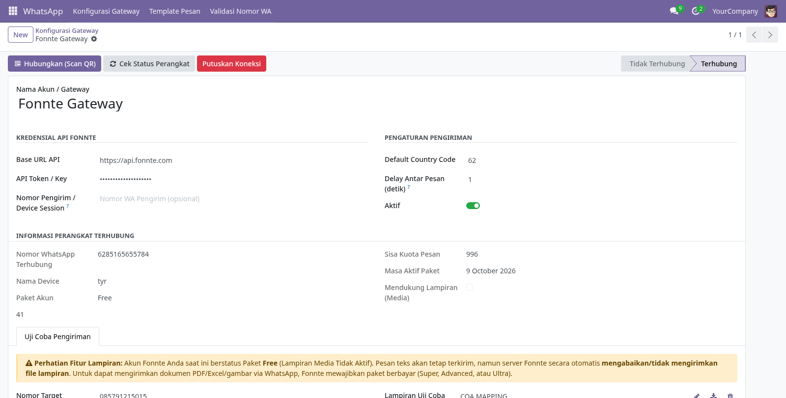
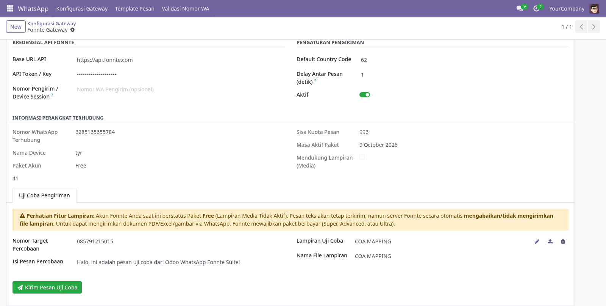
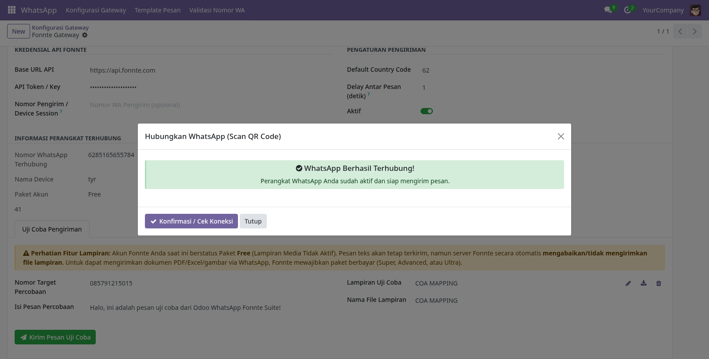
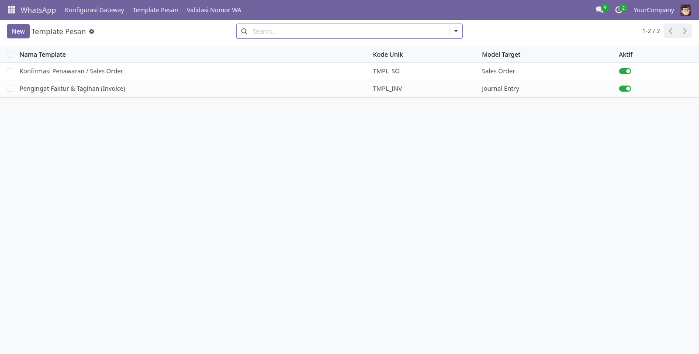
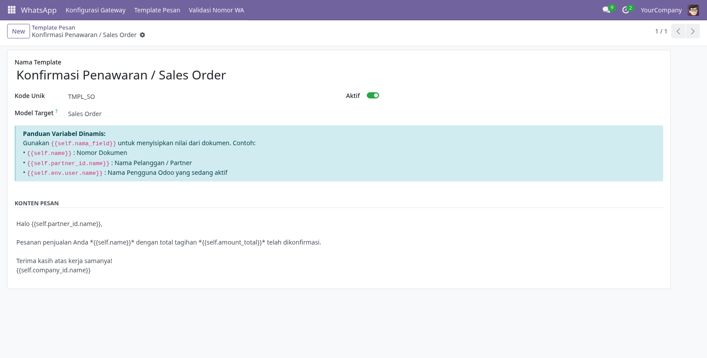
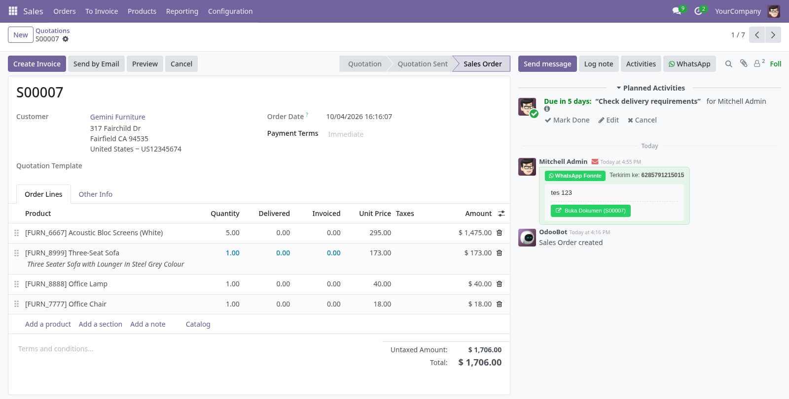
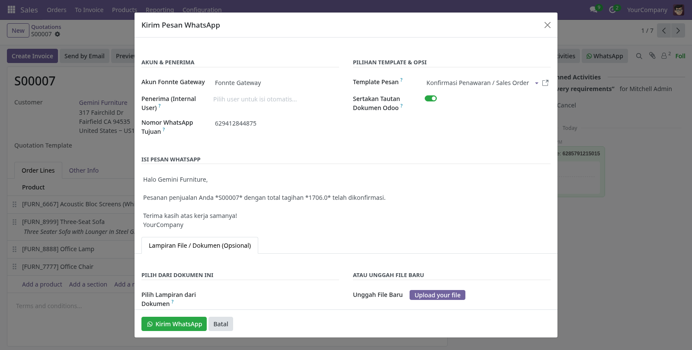

# WhatsApp Fonnte Suite & Chatter Integration (Odoo 18)

Modul integrasi WhatsApp Gateway tidak resmi (*Unofficial*) berbasis **[Fonnte](https://fonnte.com)** untuk **Odoo 18 (Community & Enterprise)**. Modul ini memungkinkan pengiriman notifikasi, dokumen (PDF/gambar), serta template pesan interaktif langsung dari panel **Chatter** dokumen Odoo (Sales Order, Customer Invoice, Purchase Order, Contact Partner, dll).

---

## ⚠️ PERINGATAN PENTING & DISCLAIMER (ANTI-SPAM POLICY)

> ### 🛑 BATASAN TANGGUNG JAWAB PENGEMBANG:
> 1. **API Tidak Resmi (Unofficial API):** Modul ini menggunakan layanan gateway pihak ketiga dari Fonnte yang bekerja secara *reverse engineering* protokol web WhatsApp dan **bukan** merupakan WhatsApp Business Cloud API resmi dari Meta Inc.
> 2. **Bebas dari Tanggung Jawab Pemblokiran / Spam:**  
>    **Pengembang dan pembuat modul ini TIDAK BERTANGGUNG JAWAB SAMA SEKALI** atas segala bentuk pemblokiran nomor (*banned / suspend* baik sementara maupun permanen), nomor dilaporkan sebagai spam oleh penerima, atau nomor ditangguhkan oleh pihak WhatsApp / Meta.
> 3. **Tanggung Jawab Penuh Pengguna:**  
>    Pengguna bertanggung jawab penuh atas segala aktivitas operasional, kepatuhan hukum, etika pengiriman pesan, serta wajib memastikan bahwa nomor penerima memang telah memberikan persetujuan (*opt-in*) untuk dihubungi.
> 4. **Hindari Spamming Massal:**  
>    Sangat dilarang menggunakan modul ini untuk *broadcast blasting* pesan spam ke nomor acak yang tidak dikenal. Gunakan jeda pengiriman (*delay*) yang memadai dan gunakan nomor WhatsApp yang sudah memiliki riwayat interaksi aktif (*warmed up*).

---

## ✨ Fitur Utama

- 💬 **Tombol WhatsApp Terintegrasi di Chatter:** Kirim pesan instan langsung dari panel chatter dokumen Odoo cukup satu klik.
- 📎 **Dukungan Dokumen & Multi-Format:** Kirim lampiran faktur (PDF), penawaran, maupun berkas gambar menggunakan *direct binary multipart upload*.
- 📝 **Template Pesan Dinamis Fleksibel:** Gunakan variabel dokumen seperti `{{self.partner_id.name}}`, `{{self.name}}`, dan `{{self.amount_total}}` yang otomatis terisi.
- 📱 **QR Code Web Scanner:** Tautkan perangkat WhatsApp langsung dari antarmuka Odoo tanpa harus membuka browser dashboard Fonnte.
- 🔍 **Cek Status & Kuota Realtime:** Pantau status koneksi, kuota pesan, tipe paket, dan kapabilitas lampiran akun secara akurat.
- 🛡️ **Validasi Nomor Tujuan:** Otomatis menstandarisasi format nomor ke format internasional (`62xxx`) dan fitur pengecekan nomor aktif WhatsApp.

---

## 📸 Tangkapan Layar Tampilan (Captured via Google Chrome)

### 1. Konfigurasi Gateway & Informasi Perangkat
Mengatur Kredensial API, jeda pesan (*delay*), serta memantau status device, sisa kuota, dan kapabilitas paket Fonnte.


---

### 2. Uji Coba Pengiriman & Deteksi Paket
Menguji coba pengiriman pesan teks dan file lampiran ke nomor tujuan tertentu, dilengkapi banner peringatan otomatis jika akun berstatus Paket *Free*.


---

### 3. Hubungkan WhatsApp via Scan QR Code
Wizard instan untuk meminta dan memindai QR Code dari server Fonnte langsung di Odoo.


---

### 4. Daftar Template Pesan WhatsApp
Kelola berbagai template notifikasi pesan untuk masing-masing model dokumen Odoo.


---

### 5. Detail Form Template Dinamis
Penyusunan format template pesan lengkap dengan panduan variabel dinamis Odoo (`{{self.nama_field}}`).


---

### 6. Integrasi Tombol WhatsApp di Panel Chatter Dokumen
Tombol WhatsApp terletak strategis di panel Chatter dokumen (Sales Order, Invoice, PO, dsb.) lengkap dengan pencatatan riwayat pesan yang terkirim.


---

### 7. Modal Pop-up Kirim Pesan WhatsApp dari Dokumen
Modal pengiriman pesan yang otomatis mendeteksi nomor kontak pelanggan, memilih template, menampilkan preview pesan, dan memilih lampiran dokumen.


---

## 🚀 Panduan Penggunaan Lengkap (Step-by-Step)

### Langkah 1: Pengaturan Global Odoo
1. Buka menu **Settings ➔ General Settings**.
2. Masuk ke grup **WhatsApp Fonnte Gateway**.
3. Pastikan opsi **Aktifkan Pengiriman Pesan WhatsApp** dalam kondisi tercentang, lalu simpan.

### Langkah 2: Menghubungkan Akun Gateway Fonnte
1. Buka aplikasi **WhatsApp ➔ Konfigurasi Gateway**.
2. Masukkan kredensial API:
   - **Base URL API:** `https://api.fonnte.com`
   - **API Token / Key:** Salin API Token dari dashboard akun Anda di [Fonnte.com](https://fonnte.com).
   - **Default Country Code:** `62` (Indonesia).
   - **Delay Antar Pesan:** Disarankan minimal `1` atau `2` detik untuk keamanan nomor.
3. Klik tombol **Hubungkan (Scan QR)** pada header formulir:
   - Buka WhatsApp di smartphone Anda ➔ Pilih **Perangkat Tertaut (Linked Devices)** ➔ Scan QR Code yang tampil di layar.
4. Klik tombol **Cek Status Perangkat** untuk memastikan status koneksi berubah menjadi **Terhubung** (*Connected*).

### Langkah 3: Melakukan Uji Coba Pengiriman
1. Pada form Konfigurasi Gateway, buka tab **Uji Coba Pengiriman**.
2. Masukkan nomor WhatsApp tujuan (misal: `081234567890`) dan isi pesan percobaan.
3. Klik tombol **Kirim Pesan Uji Coba**.
4. Periksa apakah pesan masuk di WhatsApp target.

> [!NOTE]
> **Catatan Penting Terkait Lampiran File:**
> - Akun Fonnte **Paket Free** hanya mendukung pengiriman **pesan teks**. Jika Anda menyertakan file lampiran pada paket Free, server Fonnte hanya akan mengirimkan teksnya saja dan mengabaikan file lampirannya.
> - Untuk dapat mengirim file dokumen (PDF Faktur, Excel, gambar), Anda perlu berlangganan paket berbayar (**Super, Advanced, atau Ultra**) di [Fonnte.com](https://fonnte.com).

### Langkah 4: Membuat Template Pesan WhatsApp
1. Buka menu **WhatsApp ➔ Template Pesan ➔ New**.
2. Berikan nama template dan kode unik (contoh: `TMPL_SO`).
3. Pilih **Model Target** (contoh: `Sales Order` atau `Journal Entry/Invoice`).
4. Tulis pesan menggunakan format variabel Odoo:
   ```text
   Halo {{self.partner_id.name}},

   Pesanan penjualan Anda *{{self.name}}* dengan total tagihan *{{self.amount_total}}* telah dikonfirmasi.

   Terima kasih atas kerja samanya!
   {{self.company_id.name}}
   ```
5. Simpan template.

### Langkah 5: Mengirim WhatsApp dari Dokumen (Chatter)
1. Buka salah satu dokumen bisnis Odoo (misalnya **Sales ➔ Orders ➔ Quotations** atau **Invoicing ➔ Customer Invoices**).
2. Di sebelah tombol *Activities* pada panel Chatter, klik tombol hijau **WhatsApp**.
3. Di modal yang muncul:
   - Nomor WhatsApp otomatis terisi dari data partner dokumen.
   - Pilih template pesan yang diinginkan (isi pesan otomatis terisi).
   - Lampirkan file PDF dokumen jika diperlukan (tab *Lampiran File*).
4. Klik **Kirim WhatsApp**.
5. Pesan akan terkirim dan riwayat pengiriman otomatis dicatat ke riwayat Chatter dokumen.

---

## 🛡️ Tips Keamanan Menghindari Pemblokiran WhatsApp (Anti-Ban)

1. **Gunakan Nomor Khusus:** Selalu gunakan nomor operasional perusahaan terpisah dan **jangan gunakan nomor WhatsApp pribadi penting**.
2. **Nomor Sudah Terverifikasi (Warmed Up):** Gunakan nomor yang sudah berumur dan memiliki riwayat obrolan dua arah yang wajar sebelumnya.
3. **Atur Jeda Pesan (Delay):** Jangan atur jeda pengiriman ke 0 detik. Berikan delay minimal 1–3 detik antar pengiriman.
4. **Hanya Kirim ke Kontak Valid:** Jangan mengirim pesan acak (*cold messaging*). Jika banyak penerima menekan tombol **"Laporkan Spam & Blokir"**, WhatsApp akan langsung memblokir nomor Anda.
5. **Personalisasi Pesan:** Selalu gunakan nama pelanggan pada template agar pesan terlihat personal dan bukan spam robot otomatis.

---

## 📜 Lisensi & Pengembang

- **Lisensi:** LGPL-3 (GNU Lesser General Public License v3.0)
- **Kompatibilitas:** Odoo Version 18.0
- **Dibuat oleh:** Tyr
